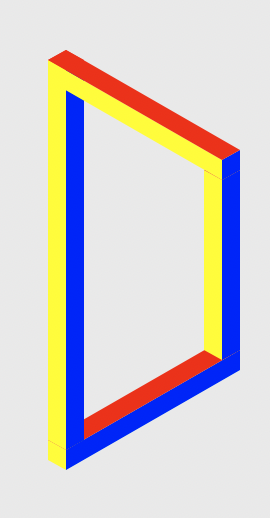

A couple of programs to recreate the 'impossible' mazes of the visual puzzle game Monument Valley. This is similar to the style of M.C. Esher’s art.

To run:
1. run `python3 Display.py`

`megaCubeAnamorphic.py` shows a large cube structure in one window, and a different, disassembled view of that cube structure in another window.

This project was originally going to be a full replica of _Monument Valley_, but I never got that far.